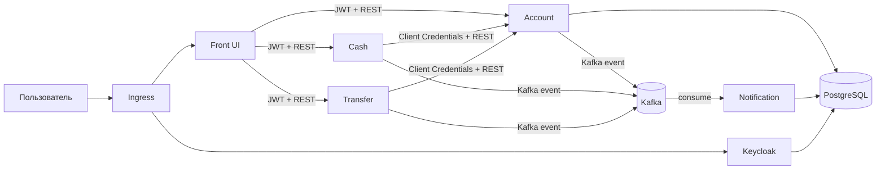

# My Bank App

Микросервисное приложение «Банк» для проектной работы 11 спринта.

Проект реализует:
- фронт с одной HTML-страницей (`front`),
- сервис аккаунтов (`account`),
- сервис внесения/снятия средств (`cash`),
- сервис переводов (`transfer`),
- сервис уведомлений (`notification`),
- OAuth 2.0 авторизацию через Keycloak,
- Service Discovery через Kubernetes Service DNS,
- конфигурацию через Kubernetes ConfigMap/Secret,
- взаимодействие сервисов уведомлений через Apache Kafka,
- развёртывание через Helm (umbrella chart + сабчарты).

## 1. Архитектура

### 1.1. Сервисы

| Модуль | Назначение | Порт |
|---|---|---:|
| `front` | UI (Thymeleaf), OAuth2 Login (Authorization Code Flow) | `8086` |
| `account` | Данные аккаунта, баланс, список получателей | `8082` |
| `cash` | Пополнение/снятие со счёта | `8083` |
| `transfer` | Переводы между пользователями | `8084` |
| `notification` | Обработка событий уведомлений из Kafka | `8085` |
| `kafka` | Брокер сообщений | `9092` |
| `keycloak` | OAuth 2.0 / OIDC сервер авторизации | `80` (svc), `8080` (container) |
| `postgresql` | Персистентная БД аккаунтов/Keycloak | `5432` |
| `ingress-nginx` | Внешний вход в приложение (Ingress) | `80/443` |

### 1.2. Схема взаимодействия



## 2. Технологии

- Java 25, Spring Boot, Spring Security
- OAuth2/OIDC (Keycloak)
- Spring Kafka
- Spring Data JPA + Hibernate
- Liquibase
- PostgreSQL
- OpenAPI Generator
- JUnit 5, Spring Boot Test, Testcontainers (в модуле `account`)
- Docker, Docker Compose
- Kubernetes
- Helm

## 3. Требования и окружение

### 3.1. Обязательные инструменты

- Docker Desktop (с включённым Kubernetes)
- `kubectl`
- `helm`
- JDK 25
- Bash/Zsh

### 3.2. Версия Java

В `build.gradle` проекта настроен toolchain `Java 25`.

## 4. Быстрый старт (Kubernetes + Helm)

### 4.1. Сборка jar-файлов

Из корня проекта:

```bash
bash ./gradlew clean build
```

### 4.2. Сборка Docker-образов

```bash
docker build -t front-app:latest ./front
docker build -t account-app:latest ./account
docker build -t cash-app:latest ./cash
docker build -t transfer-app:latest ./transfer
docker build -t notification-app:latest ./notification
```

### 4.3. Установка ingress-nginx

```bash
helm repo add ingress-nginx https://kubernetes.github.io/ingress-nginx
helm repo update
kubectl create namespace ingress-nginx --dry-run=client -o yaml | kubectl apply -f -
helm upgrade --install ingress-nginx ingress-nginx/ingress-nginx -n ingress-nginx
```

### 4.4. Деплой приложения

```bash
helm repo add kafka-repo https://helm-charts.itboon.top/kafka
helm repo update

for chart in front account cash transfer notification; do
  helm dependency update helm/my-bank/charts/$chart
done
helm dependency update helm/my-bank
helm upgrade --install my-bank helm/my-bank \
  -f helm/my-bank/values.yaml \
  -f helm/my-bank/values-secret.yaml
```

### 4.5. Проверка статуса

```bash
kubectl get pods
kubectl get svc
kubectl get ingress
```

Открыть:
- Front UI: [http://localhost/](http://localhost/)

### 4.6. Остановка

```bash
helm uninstall my-bank
```

## 5. Локальный запуск сервисов (legacy Docker Compose)

Вариант для локальной разработки без Kubernetes.

```bash
docker compose up -d --build
```

Открыть:
- Front UI: [http://localhost:8086](http://localhost:8086)
- Keycloak: [http://localhost:8080](http://localhost:8080)

Остановка:

```bash
docker compose down
```

С удалением volume БД:

```bash
docker compose down -v
```

## 6. Учётные данные для тестирования

### 6.1. Keycloak

- админ-консоль: `admin / admin`
- realm: `my-bank-realm`

### 6.2. Пользователи

Из realm-импорта преднастроены:
- `ivanivanov / ivan123`
- `petrpetrov / petr123`

### 6.3. Аккаунты в БД (Liquibase seed)

`account`-сервис заполняет таблицу `account` начальными данными:
- `ivanivanov` (Ivan Ivanov)
- `petrpetrov` (Petr Petrov)
- `mariaivanova` (Мария Иванова)
- `sergeysmirnov` (Сергей Смирнов)
- `olgakuznetsova` (Ольга Кузнецова)

## 7. Пользовательские сценарии

После входа в `front` доступны:

1. Редактирование профиля
- Изменение ФИО и даты рождения.
- Бизнес-валидация возраста: 18+.

2. Операции со счётом
- Пополнение.
- Снятие (с проверкой на недостаточность средств).

3. Переводы
- Выбор получателя.
- Перевод суммы другому пользователю.

4. Выход
- Кнопка выхода завершает локальную сессию и OIDC-сессию в Keycloak.

## 8. API и OpenAPI

OpenAPI-спецификации лежат в директории [`openapi`](./openapi):
- `account-public-openapi.yaml`
- `account-internal-openapi.yaml`
- `cash-openapi.yaml`
- `transfer-openapi.yaml`
- `notification-openapi.yaml`

Генерация серверных/клиентских интерфейсов выполняется в Gradle-задачах модулей и автоматически привязана к `compileJava`.

## 9. Тестирование

### 9.1. Все модульные тесты

```bash
bash ./gradlew test
```

### 9.2. Интеграционные тесты (`*IT`)

```bash
bash ./gradlew integrationTest
```

### 9.3. Helm-тесты

```bash
helm lint helm/my-bank -f helm/my-bank/values.yaml -f helm/my-bank/values-secret.yaml
helm template my-bank helm/my-bank -f helm/my-bank/values.yaml -f helm/my-bank/values-secret.yaml
helm test my-bank
```

## 10. Docker-образы и упаковка

Каждый сервис собирается в Executable JAR и упаковывается в отдельный Docker-образ (`Single Service per Host`):
- `front/Dockerfile`
- `account/Dockerfile`
- `cash/Dockerfile`
- `transfer/Dockerfile`
- `notification/Dockerfile`

Dockerfile сервисов выполнены в формате multi-stage build.

## 11. Конфигурация и секреты

### 11.1. Локальные переменные окружения (Docker Compose)

Файл `.env`:
- `POSTGRES_USER`
- `POSTGRES_PASSWORD`
- `POSTGRES_DB`

### 11.2. Kubernetes ConfigMap/Secret

Настройки и секреты сервисов задаются в Helm:
- [`helm/my-bank/values.yaml`](./helm/my-bank/values.yaml)
- [`helm/my-bank/values-secret.yaml`](./helm/my-bank/values-secret.yaml)

В кластере они рендерятся в `ConfigMap` и `Secret` каждого сабчарта.

## 12. Kafka и DLQ

- События уведомлений публикуются в Kafka-топик `notification-events`.
- `notification` обрабатывает сообщения как Kafka consumer (стратегия `at least once`).
- При ошибках обработки сообщения сохраняются в DLQ в БД (`notification_app.dead_letter_queue`).

## 13. Структура проекта

```text
my-bank-app/
├── account/
├── cash/
├── front/
├── notification/
├── transfer/
├── openapi/
├── helm/
│   └── my-bank/
├── docker/
├── docker-compose.yml
├── build.gradle
└── settings.gradle
```
