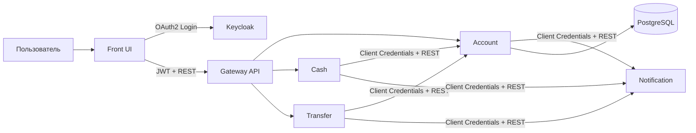

# My Bank App

Микросервисное приложение «Банк» для проектной работы 9 спринта.

Проект реализует:
- фронт с одной HTML-страницей (`front`),
- Gateway API (`gateway`),
- сервис аккаунтов (`account`),
- сервис внесения/снятия средств (`cash`),
- сервис переводов (`transfer`),
- сервис уведомлений (`notification`),
- OAuth 2.0 авторизацию через Keycloak,
- Service Discovery + Externalized Config через Consul,
- запуск всех компонентов через Docker Compose.

## 1. Архитектура

### 1.1. Сервисы

| Модуль | Назначение | Порт |
|---|---|---:|
| `front` | UI (Thymeleaf), OAuth2 Login (Authorization Code Flow), запросы в Gateway | `8086` |
| `gateway` | Маршрутизация запросов в микросервисы, проброс JWT (`TokenRelay`) | `8081` |
| `account` | Данные аккаунта, баланс, список получателей | `8082` |
| `cash` | Пополнение/снятие со счёта | `8083` |
| `transfer` | Переводы между пользователями | `8084` |
| `notification` | Обработка событий уведомлений | `8085` |
| `keycloak` | OAuth 2.0 / OIDC сервер авторизации | `8080` |
| `consul` | Service Discovery + Config KV | `8500` |
| `bank-db` (PostgreSQL) | Персистентная БД аккаунтов | `5433 -> 5432` |

### 1.2. Схема взаимодействия



## 2. Технологии

- Java, Spring Boot, Spring Security, Spring Cloud
- Spring Cloud Gateway Server WebMVC
- Spring Cloud Consul Discovery + Config
- OAuth2/OIDC (Keycloak)
- Spring Data JPA + Hibernate
- Liquibase
- PostgreSQL
- OpenAPI Generator
- JUnit 5, Spring Boot Test, Testcontainers (в модуле `account`)
- Docker, Docker Compose

## 3. Требования и окружение

### 3.1. Обязательные инструменты

- Docker + Docker Compose
- JDK (см. замечание ниже)
- Bash/Zsh

### 3.2. Версия Java

В `build.gradle` проекта сейчас настроен toolchain `Java 25`.

ТЗ требует Java 21. Для полного соответствия ТЗ:
1. либо установить Java 25 для текущей конфигурации,
2. либо изменить `JavaLanguageVersion.of(25)` на `JavaLanguageVersion.of(21)` и проверить сборку/тесты.

## 4. Быстрый старт (рекомендуется: Docker Compose)

> В проекте используется `.env` с параметрами PostgreSQL и Consul.

### 4.1. Сборка jar-файлов

Из корня проекта:

```bash
bash ./gradlew clean build
```

### 4.2. Запуск всех сервисов

```bash
docker compose up -d --build
```

### 4.3. Проверка статуса

```bash
docker ps
```

Открыть:
- Front UI: [http://localhost:8086](http://localhost:8086)
- Keycloak: [http://localhost:8080](http://localhost:8080)
- Consul UI: [http://localhost:8500](http://localhost:8500)

### 4.4. Остановка

```bash
docker compose down
```

С удалением volume БД/Consul:

```bash
docker compose down -v
```

## 5. Локальный запуск сервисов (без контейнеров приложений)

Вариант для разработки: инфраструктура в Docker, сервисы через Gradle.

### 5.1. Поднять инфраструктуру

```bash
docker compose up -d bank-db consul consul-seeder keycloak
```

### 5.2. Запуск сервисов по одному

```bash
bash ./gradlew :gateway:bootRun
bash ./gradlew :front:bootRun
bash ./gradlew :account:bootRun
bash ./gradlew :cash:bootRun
bash ./gradlew :transfer:bootRun
bash ./gradlew :notification:bootRun
```

Примечание: сервисы читают конфигурацию из Consul (`config/<service>/data`).

## 6. Учётные данные для тестирования

### 6.1. Keycloak

- админ-консоль: `admin / admin`
- realm: `my-bank-realm`

### 6.2. Пользователи

Из realm-импорта преднастроены:
- `ivanivanov / ivan123`
- `petrpetrov / petr123`

### 6.3. Аккаунты в БД (Liquibase seed)

`account`-сервис заполняет таблицу `account` начальными данными:
- `ivanivanov` (Ivan Ivanov)
- `petrpetrov` (Petr Petrov)
- `mariaivanova` (Мария Иванова)
- `sergeysmirnov` (Сергей Смирнов)
- `olgakuznetsova` (Ольга Кузнецова)

## 7. Пользовательские сценарии

После входа в `front` доступны:

1. Редактирование профиля
- Изменение ФИО и даты рождения.
- Бизнес-валидация возраста: 18+.

2. Операции со счётом
- Пополнение.
- Снятие (с проверкой на недостаточность средств).

3. Переводы
- Выбор получателя.
- Перевод суммы другому пользователю.

4. Выход
- Кнопка выхода завершает локальную сессию и OIDC-сессию в Keycloak.

## 8. API и OpenAPI

OpenAPI-спецификации лежат в директории [`openapi`](./openapi):
- `account-public-openapi.yaml`
- `account-internal-openapi.yaml`
- `cash-openapi.yaml`
- `transfer-openapi.yaml`
- `notification-openapi.yaml`

Генерация серверных/клиентских интерфейсов выполняется в Gradle-задачах модулей и автоматически привязана к `compileJava`.

## 9. Тестирование

### 9.1. Все модульные тесты

```bash
bash ./gradlew test
```

### 9.2. Интеграционные тесты (`*IT`)

```bash
bash ./gradlew integrationTest
```

### 9.3. По модулю

```bash
bash ./gradlew :account:test
bash ./gradlew :cash:test
bash ./gradlew :transfer:test
bash ./gradlew :notification:test
bash ./gradlew :front:test
```

## 10. Docker-образы и упаковка

Каждый сервис собирается в Executable JAR и упаковывается в отдельный Docker-образ (`Single Service per Host`):
- `front/Dockerfile`
- `gateway/Dockerfile`
- `account/Dockerfile`
- `cash/Dockerfile`
- `transfer/Dockerfile`
- `notification/Dockerfile`

Базовый образ: `amazoncorretto:25-alpine-jdk`.

## 11. Конфигурация и секреты

### 11.1. Локальные переменные окружения

Файл `.env`:
- `POSTGRES_USER`
- `POSTGRES_PASSWORD`
- `POSTGRES_DB`
- `CONSUL_HOST`
- `CONSUL_PORT`

### 11.2. Consul KV

Файлы конфигурации для сервисов находятся в [`consul-kv`](./consul-kv):
- `front.yml`, `gateway.yml`, `account.yml`, `cash.yml`, `transfer.yml`, `notification.yml`

`consul-seeder` в `docker-compose.yml` загружает их в KV при старте.

## 12. Структура проекта

```text
my-bank-app/
├── account/
├── cash/
├── front/
├── gateway/
├── notification/
├── transfer/
├── openapi/
├── consul-kv/
├── docker/
├── docker-compose.yml
├── build.gradle
└── settings.gradle
```