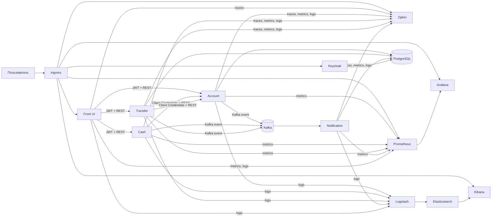

# My Bank App

Микросервисный banking-проект, в котором я собрал не только бизнес-функции, но и production-oriented практики: устойчивые интеграции, безопасность, компенсационные сценарии, observability и инфраструктуру поставки. Это проект не только про "переводы и счета", а про то, как выглядит зрелая backend-система, которую можно развивать, сопровождать и диагностировать.

## Технологии

- Java 25
- Spring Boot 4, Spring Security, Spring OAuth2 Client / Resource Server
- Spring Data JPA, Hibernate, Liquibase
- Spring Kafka
- Resilience4j
- Micrometer, Spring Boot Actuator
- Micrometer Tracing + Zipkin
- Prometheus + Grafana
- Log4j2 + Logstash + Elasticsearch + Kibana
- PostgreSQL
- Docker, Kubernetes, Helm
- JUnit 5, Spring Boot Test, Testcontainers, Embedded Kafka

## Почему проект важен

- Показывает проектирование микросервисной системы целиком, а не отдельного CRUD-сервиса.
- Демонстрирует работу с distributed flows: синхронные вызовы, Kafka-события, compensation и outbox.
- Подтверждает опыт с security, observability и k8s-ready инфраструктурой.
- Отражает эволюцию архитектуры по веткам, включая этап со `Spring Cloud`.

## Ключевые инженерные решения

- В `transfer` реализован saga-like orchestration flow для перевода денег: списание, попытка зачисления, компенсация при сбое и фиксация финального статуса операции.
- Для асинхронных действий используется transactional outbox: событие сохраняется вместе с бизнес-состоянием, а затем обрабатывается отдельным worker-процессом с retry, backoff и dead-state.
- Межсервисная безопасность построена на OAuth2/JWT, пользовательский вход и machine-to-machine интеграции разделены и настроены явно.
- Интеграции усилены Resilience4j: retry, circuit breaker и нормализация ошибок внешних сервисов.
- Взаимодействие сервисов оформлено через OpenAPI-контракты и generated clients, а не через неявные ручные интеграции.

## Эволюция проекта по веткам

- `module_3_sprint_9`: Spring Cloud, `gateway`, Consul Discovery и Consul Config.
- `module_3_sprint_10`-`module_3_sprint_11`: развитие микросервисной логики, Kafka, security и тестового контура.
- `module_3_sprint_12`: observability-стек, business metrics, dashboards, alerts, ELK и Kubernetes-полировка.

## Архитектура

Проект включает:
- `front` с HTML UI и OAuth2 Login через Keycloak;
- `account`, `cash`, `transfer`, `notification` как отдельные Spring Boot микросервисы;
- Kafka для событий уведомлений;
- PostgreSQL для хранения данных;
- observability-стек: Zipkin, Prometheus, Grafana, Elasticsearch, Logstash, Kibana;
- развёртывание в Kubernetes через umbrella Helm chart.

### Сервисы

| Модуль | Назначение | Порт |
|---|---|---:|
| `front` | UI, OAuth2 Authorization Code Flow | `8086` |
| `account` | Данные аккаунта, баланс, список получателей | `8082` |
| `cash` | Пополнение и снятие средств | `8083` |
| `transfer` | Переводы между пользователями | `8084` |
| `notification` | Обработка Kafka-событий уведомлений | `8085` |
| `keycloak` | OAuth2 / OIDC сервер авторизации | `80` |
| `postgresql` | База данных | `5432` |
| `kafka` | Брокер сообщений | `9092` |
| `zipkin` | Распределённый трейсинг | `9411` |
| `prometheus` | Сбор метрик и alert rules | `80` |
| `alertmanager` | Обработка alert-событий Prometheus | `9093` |
| `grafana` | Дашборды метрик | `80` |
| `elasticsearch` | Хранилище логов | `9200` |
| `logstash` | Приём и обработка логов | `5044` / `9600` |
| `kibana` | Поиск и анализ логов | `5601` |

### Схема взаимодействия


```mermaid
flowchart LR
  User["Пользователь"] --> Ingress["Ingress"]
  Ingress --> Front["Front UI"]
  Ingress --> Keycloak["Keycloak"]
  Ingress --> Zipkin["Zipkin"]
  Ingress --> Prometheus["Prometheus"]
  Ingress --> Grafana["Grafana"]
  Ingress --> Kibana["Kibana"]

  Front -->|JWT + REST| Account["Account"]
  Front -->|JWT + REST| Cash["Cash"]
  Front -->|JWT + REST| Transfer["Transfer"]

  Cash -->|Client Credentials + REST| Account
  Transfer -->|Client Credentials + REST| Account

  Account --> DB[(PostgreSQL)]
  Transfer --> DB
  Notification --> DB
  Keycloak --> DB

  Account -->|Kafka event| Kafka[(Kafka)]
  Cash -->|Kafka event| Kafka
  Transfer -->|Kafka event| Kafka
  Kafka --> Notification

  Front -->|traces| Zipkin
  Account -->|traces, metrics, logs| Zipkin
  Account -->|metrics| Prometheus
  Account -->|logs| Logstash["Logstash"]
  Cash -->|traces, metrics, logs| Zipkin
  Cash -->|metrics| Prometheus
  Cash -->|logs| Logstash
  Transfer -->|traces, metrics, logs| Zipkin
  Transfer -->|metrics| Prometheus
  Transfer -->|logs| Logstash
  Notification -->|traces, metrics, logs| Zipkin
  Notification -->|metrics| Prometheus
  Notification -->|logs| Logstash
  Front -->|metrics, logs| Prometheus
  Front -->|logs| Logstash

  Logstash --> Elasticsearch["Elasticsearch"]
  Prometheus --> Grafana
  Elasticsearch --> Kibana
```

## Observability

### Трейсинг

Во всех сервисах и во `front` настроен distributed tracing через Zipkin:
- входящие HTTP-запросы;
- исходящие HTTP-запросы;
- Kafka producer / consumer observations;
- обращения к БД через datasource observations.

Адрес:
- Zipkin: [http://zipkin.localhost](http://zipkin.localhost)

Как пользоваться:
- откройте `Zipkin`;
- выберите нужный `serviceName` (`front`, `account`, `cash`, `transfer`, `notification`);
- ищите трейсы по времени и длительности;
- внутри трейса видно цепочку запросов между сервисами и дочерние спаны.

### Метрики

Prometheus собирает метрики со всех приложений по `/actuator/prometheus`.

Адреса:
- Prometheus: [http://prometheus.localhost](http://prometheus.localhost)
- Grafana: [http://grafana.localhost](http://grafana.localhost)

Учетные данные Grafana:
- `admin / admin`

Собираются:
- HTTP-метрики: `RPS`, `4xx`, `5xx`, latency percentiles `p50/p95/p99`;
- JVM-метрики: память, CPU, потоки, GC;
- Spring Boot / process метрики;
- бизнес-метрики:
  - `bank_cash_deposit_failures_total` — неуспешные пополнения по `username`;
  - `bank_cash_withdraw_failures_total` — неуспешные снятия по `username`;
  - `bank_transfer_failures_total` — неуспешные переводы по `username_from` и `username_to`.

Примечание: пункт про метрику и алерт по невозможности отправки уведомления сервисом `notification` не реализован осознанно, так как уведомления в текущей реализации записываются в логи, и отдельные ошибочные метрики/алерты для этого сценария не добавлялись.

### Дашборды Grafana

В Grafana автоматически провиженятся три дашборда в папке `My Bank`:

1. `My Bank HTTP Overview`
- входящий `RPS` по сервисам;
- `4xx` / `5xx`;
- `p50/p95/p99` latency входящих запросов;
- `p95` latency исходящих HTTP-вызовов.

2. `My Bank JVM Overview`
- heap / non-heap memory;
- `process_cpu_usage`;
- live threads;
- частота GC pause events.

3. `My Bank Business Metrics`
- неуспешные пополнения по пользователям;
- неуспешные снятия по пользователям;
- неуспешные переводы по отправителю и получателю.

Как пользоваться:
- откройте Grafana;
- перейдите в `Dashboards -> My Bank`;
- выберите один из дашбордов;
- меняйте time range и изучайте панели по сервисам.

### Алерты

Алерты настроены в Prometheus через `alerting_rules.yml`.

Сейчас есть правила:
- `MyBankServiceDown` — сервис не отдаёт метрики;
- `MyBankHighHttp5xxRate` — повышенный поток `5xx`;
- `MyBankHighHttpP95Latency` — p95 входящих HTTP-запросов выше порога;
- `MyBankCashDepositFailures` — всплеск неуспешных пополнений;
- `MyBankCashWithdrawFailures` — всплеск неуспешных снятий;
- `MyBankTransferFailures` — всплеск неуспешных переводов.

Примечание: отдельный алерт по невозможности отправки уведомления сервисом `notification` не настраивался.

Как посмотреть:
- откройте Prometheus;
- перейдите в `Alerts`;
- смотрите состояние правил (`inactive`, `pending`, `firing`).

Адреса:
- Kubernetes (через ingress): Prometheus — [http://prometheus.localhost](http://prometheus.localhost)
- Docker Compose: Prometheus — [http://localhost:9090](http://localhost:9090), Alertmanager — [http://localhost:9093](http://localhost:9093)

### Логи

Логи всех приложений пишутся:
- в консоль в человекочитаемом формате;
- напрямую в Logstash по TCP в JSON-формате.

В логах есть поля:
- `service`
- `level`
- `traceId`
- `spanId`
- `message`
- `exception`

Logstash:
- принимает JSON-логи;
- нормализует `@timestamp`;
- маскирует типовые чувствительные фрагменты (`password=...`, `token=...`, `Bearer ...`);
- пишет документы в индексы `bank-logs-*` в Elasticsearch.

Адрес:
- Kibana: [http://kibana.localhost](http://kibana.localhost)

Как пользоваться:
- откройте Kibana;
- перейдите в `Discover`;
- data view `bank-logs-*` и сохранённый поиск `Bank Logs` импортируются автоматически при старте Kibana;
- фильтруйте по `service`, `level`, `traceId`, `spanId`.

Примеры KQL-запросов:

```text
service : "cash"
```

```text
level : "ERROR"
```

```text
traceId : "ВАШ_TRACE_ID"
```

## Требования

Нужно установить:
- Docker Desktop с включённым Kubernetes;
- `kubectl`;
- `helm`;
- JDK 25;
- Bash или Zsh.

В проекте настроен Gradle toolchain `Java 25`.

## Быстрый старт в Kubernetes

### 1. Сборка Docker-образов

Из корня проекта:

```bash
docker build -f front/Dockerfile -t front-app:1.3.8 .
docker build -f account/Dockerfile -t account-app:1.3.8 .
docker build -f cash/Dockerfile -t cash-app:1.3.8 .
docker build -f transfer/Dockerfile -t transfer-app:1.3.8 .
docker build -f notification/Dockerfile -t notification-app:1.3.8 .
docker build -f logstash/Dockerfile -t my-bank-logstash:1.0.0 .
```

### 2. Установка ingress-nginx

```bash
helm repo add ingress-nginx https://kubernetes.github.io/ingress-nginx
helm repo update
kubectl create namespace ingress-nginx --dry-run=client -o yaml | kubectl apply -f -
helm upgrade --install ingress-nginx ingress-nginx/ingress-nginx -n ingress-nginx
```

### 3. Обновление зависимостей Helm

```bash
helm repo add kafka-repo https://helm-charts.itboon.top/kafka
helm repo update

for chart in front account cash transfer notification; do
  helm dependency update helm/my-bank/charts/$chart
done

helm dependency update helm/my-bank
```

### 4. Деплой приложения

```bash
helm upgrade --install my-bank helm/my-bank \
  -f helm/my-bank/values.yaml \
  -f helm/my-bank/values-secret.yaml
```

### 5. Проверка статуса

```bash
kubectl get pods
kubectl get svc
kubectl get ingress
helm status my-bank
helm test my-bank
```

### 6. Точки входа

- Front UI: [http://localhost/](http://localhost/)
- Zipkin: [http://zipkin.localhost](http://zipkin.localhost)
- Prometheus: [http://prometheus.localhost](http://prometheus.localhost)
- Grafana: [http://grafana.localhost](http://grafana.localhost)
- Kibana: [http://kibana.localhost](http://kibana.localhost)

### 7. Остановка

```bash
helm uninstall my-bank
```

## Локальный запуск без Kubernetes

Для локального запуска полного стенда (включая observability и alerting) можно использовать Docker Compose:

```bash
docker compose up -d --build
```

Доступно:
- Front UI: [http://localhost:8086](http://localhost:8086)
- Keycloak: [http://localhost:8080](http://localhost:8080)
- Zipkin: [http://localhost:9411](http://localhost:9411)
- Prometheus: [http://localhost:9090](http://localhost:9090)
- Alertmanager: [http://localhost:9093](http://localhost:9093)
- Grafana: [http://localhost:3000](http://localhost:3000)
- Kibana: [http://localhost:5601](http://localhost:5601)

Остановка:

```bash
docker compose down
```

С удалением volume:

```bash
docker compose down -v
```

Для Docker Compose и Kubernetes + Helm используются одинаковые метрики, дашборды и alert rules.

## Учётные данные

### Keycloak

- админ-консоль: `admin / admin`
- realm: `my-bank-realm`

### Пользователи

- `ivanivanov / ivan123`
- `petrpetrov / petr123`

### Grafana

- `admin / admin`

## Пользовательские сценарии

После входа во `front` доступны:
- просмотр текущего аккаунта;
- изменение профиля;
- пополнение счёта;
- снятие средств;
- перевод другому пользователю;
- выход из сессии.

## OpenAPI

Спецификации лежат в [`openapi`](./openapi):
- `account-public-openapi.yaml`
- `account-internal-openapi.yaml`
- `cash-openapi.yaml`
- `transfer-openapi.yaml`

Генерация серверных и клиентских интерфейсов привязана к `compileJava`.

## Тестирование

### Unit и module tests

```bash
bash ./gradlew test
```

### Integration tests

```bash
bash ./gradlew integrationTest
```

### Helm-проверки

```bash
helm lint helm/my-bank -f helm/my-bank/values.yaml -f helm/my-bank/values-secret.yaml
helm template my-bank helm/my-bank -f helm/my-bank/values.yaml -f helm/my-bank/values-secret.yaml
helm test my-bank
```

## Полезные файлы

- [`helm/my-bank/values.yaml`](./helm/my-bank/values.yaml)
- [`helm/my-bank/values-secret.yaml`](./helm/my-bank/values-secret.yaml)
- [`helm/my-bank/templates/tests/smoke-test.yaml`](./helm/my-bank/templates/tests/smoke-test.yaml)
- [`helm/my-bank/dashboards/my-bank-http.json`](./helm/my-bank/dashboards/my-bank-http.json)
- [`helm/my-bank/dashboards/my-bank-jvm.json`](./helm/my-bank/dashboards/my-bank-jvm.json)
- [`helm/my-bank/dashboards/my-bank-business.json`](./helm/my-bank/dashboards/my-bank-business.json)
